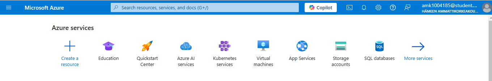
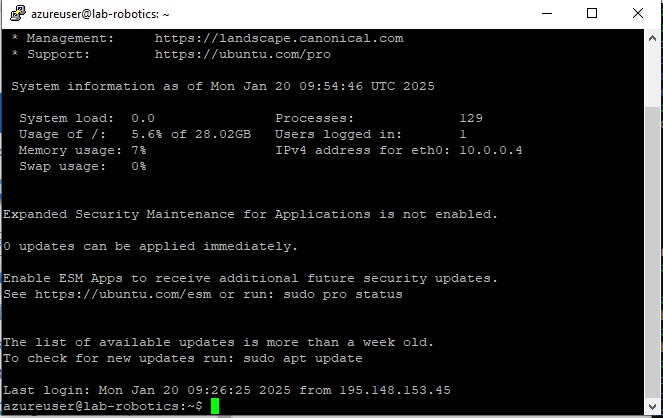

# Linux
Linux_Assignment
Assingment 1 - Virtual Machine creation

1)Create a new Azure account for yourself using your HAMK student ID (email) here portal.azure.com

2) After create Azure account for Students subscription, I can go and create a new virtual machine.
   Go to the homepage portal.azure.com and create a new resource, a virtual machine

3)
select Marketplace from Ubuntu Server 24.04 LTS gen 2 Server published by Canonical. 
Name my machine logically. 
Set the machine virtual machine size to Standard_B2ls_v2. 
Specify the public ip to which you allow SSH traffic 
Create yourself either a username and ssh key or an ID and password. 
Create a new resource group for the machine and a subnet to place the machine in 

4)Try logging in after machine creation is successful Connect: Use an SSH client to connect to your virtual machine

5)
download PyTTY 
 https://www.chiark.greenend.org.uk/~sgtatham/putty/latest.html We recommend installing the 64-bit x86 MSI package of PuTTY

Use the username and password or username and ssh key that you specified during installation.

6)I created my GitHub account Nimnawalisundara is my user name and I created repository as Linux

